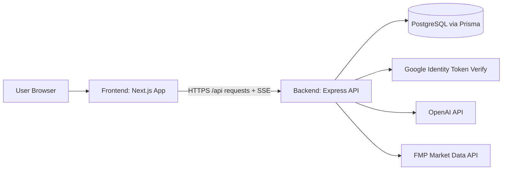

# Build with AI (Crux AI)

Full-stack AI-assisted valuation platform with a Next.js frontend and an Express + Prisma backend.

## What This Project Does

Build with AI helps users:
- sign in with Google authentication,
- run AI-driven valuation workflows,
- analyze forex and ERP inputs,
- and manage valuation records across a guided multi-step flow.

The codebase is split into:
- `frontend` - Next.js 16 (App Router, TypeScript, Tailwind, component-driven UI)
- `backend` - Express API, Prisma ORM, PostgreSQL, JWT + refresh-session auth

## System Architecture



### High-Level Layers

- **Presentation Layer (`frontend`)**
  - App Router pages for landing, auth, dashboard, valuation suite
  - Reusable UI components and feature shells
  - API client modules for auth, valuation, forex, ERP, and streaming
- **API Layer (`backend/src`)**
  - Route modules grouped by domain (`auth`, `agents`, `valuations`, `forex`, `erp`)
  - Controller + service split for request handling and business logic
  - Middleware for auth, validation, and centralized error handling
- **Data Layer (`backend/prisma`)**
  - Prisma schema with models: `User`, `Account`, `Session`, `Valuation`
  - PostgreSQL datasource

## Repository Structure

```text
Build_with_AI/
|- frontend/
|  |- src/app/                          # Next.js routes (landing, auth, dashboard)
|  |- src/components/                   # UI and domain components
|  |- src/contexts/auth-context.tsx     # Auth state and session lifecycle
|  |- src/lib/*-client.ts               # API/SSE client modules
|  |- .env                              # Frontend env vars
|
|- backend/
|  |- src/server.js                     # Local server bootstrap
|  |- src/app.js                        # Express app composition
|  |- src/routes/index.js               # Main API router
|  |- src/modules/                      # Domain modules (auth, agents, etc.)
|  |- src/middlewares/                  # auth, validation, error middlewares
|  |- src/lib/prisma.js                 # Prisma client singleton
|  |- prisma/schema.prisma              # Data model
|  |- .env / .env.example               # Backend env vars
|
|- README.md
```

## Backend Architecture Details

### Entry Points

- `backend/src/server.js`
  - Starts local server (`npm start`, `npm run dev`)
  - Handles graceful shutdown and Prisma disconnect
- `backend/src/app.js`
  - Configures CORS, JSON parser, cookies, health endpoints
  - Mounts `/api` routes lazily

### API Modules

Main API router: `backend/src/routes/index.js`

- `/api/auth`
  - `POST /google` - Google token sign-in
  - `POST /refresh` - rotate refresh session + issue new access token
  - `POST /logout` - revoke refresh session
  - `GET /me` - current authenticated user
- `/api/agents`
  - valuation assistant endpoints (sync + stream)
- `/api/valuations`
  - create/list/get/update/delete valuations
  - AI helper endpoints for company profile, peers, financials, valuation
- `/api/forex`
  - forex pairs, historical data, AI analysis
- `/api/erp`
  - ERP data retrieval and analysis

### Auth and Security Flow

- Google sign-in token verification (`google-auth-library`)
- JWT access tokens for API authentication
- HttpOnly refresh token cookie + persisted refresh sessions in DB
- Middleware-based auth + Zod request validation
- Centralized error middleware for Prisma/Zod/JWT/api errors

### Database Model (Prisma)

Core models:
- `User` - identity and profile
- `Account` - provider account mapping
- `Session` - refresh token session tracking
- `Valuation` - multi-step valuation workspace with JSON step payloads and status

## Frontend Architecture Details

### Framework and UI

- Next.js 16 App Router + React 19 + TypeScript
- Tailwind CSS 4 + component library under `src/components/ui`
- Feature-centric component organization (`auth`, `dashboard`, `valuation-suite`)

### Main Routes

- `/` - landing page
- `/signin`, `/signup` - auth pages
- `/dashboard` - main application shell
- `/dashboard/valuation-suite` - valuation listing
- `/dashboard/valuation-suite/[id]` - valuation detail workflow

### Client State and API Integration

- Auth state managed in `src/contexts/auth-context.tsx`
- API base URL and public env config in `src/lib/env.ts`
- Domain clients:
  - `auth-client.ts`
  - `valuation-client.ts`
  - `valuation-suite-client.ts`
  - `forex-client.ts`
  - `erp-client.ts`

## Prerequisites

- Node.js `>= 20`
- npm
- PostgreSQL database
- Google OAuth client ID
- OpenAI API key

## Environment Variables

### Backend (`backend/.env`)

Use `backend/.env.example` as a starting point.

Required keys used by the backend:
- `NODE_ENV`
- `PORT`
- `CLIENT_ORIGIN` (comma-separated origins supported)
- `DATABASE_URL`
- `GOOGLE_CLIENT_ID`
- `JWT_ACCESS_SECRET` (min 32 chars)
- `JWT_REFRESH_SECRET` (min 32 chars)
- `ACCESS_TOKEN_EXPIRES_IN`
- `REFRESH_TOKEN_EXPIRES_IN`
- `REFRESH_TOKEN_COOKIE_NAME`
- `COOKIE_DOMAIN` (optional)
- `OPENAI_API_KEY`
- `OPENAI_MODEL` (default: `gpt-4.1`)
- `FMP_API_KEY` (optional but recommended for forex data)

### Frontend (`frontend/.env`)

- `NEXT_PUBLIC_API_BASE_URL` (example: `http://localhost:5000/api`)
- `NEXT_PUBLIC_GOOGLE_CLIENT_ID`

## Local Development Setup

### 1) Install dependencies

```bash
cd backend
npm install
cd ../frontend
npm install
```

### 2) Configure environments

- Create/update `backend/.env` from `backend/.env.example`
- Create/update `frontend/.env` with API base URL and Google client ID

### 3) Prepare database

```bash
cd backend
npm run prisma:generate
npm run prisma:migrate
```

### 4) Start both apps

Terminal A:
```bash
cd backend
npm run dev
```

Terminal B:
```bash
cd frontend
npm run dev
```

Default local URLs:
- Frontend: `http://localhost:3000`
- Backend: `http://localhost:5000`
- Health checks: `http://localhost:5000/health` and `http://localhost:5000/api/health`

## Available Scripts

### Backend (`backend/package.json`)

- `npm run dev` - start backend with nodemon
- `npm start` - start backend
- `npm run build` - generate Prisma client
- `npm run prisma:generate`
- `npm run prisma:push`
- `npm run prisma:migrate`
- `npm run prisma:studio`

### Frontend (`frontend/package.json`)

- `npm run dev` - start Next.js dev server
- `npm run build` - production build
- `npm run start` - serve production build
- `npm run lint` - run ESLint

## Typical Developer Flow

1. Start backend + frontend locally.
2. Authenticate via Google from the frontend.
3. Use dashboard modules (agents, forex, ERP, valuation suite).
4. Persist and revisit valuations from the valuation suite routes.
5. Iterate on backend module/service logic and frontend feature components.

## API Health and Smoke Test

Quick checks after local startup:

```bash
curl http://localhost:5000/health
curl http://localhost:5000/api/health
```

You should receive a success payload with a timestamp.

## Notes

- This repo currently does not include automated test scripts in `package.json`.
- If you deploy, ensure environment variables and allowed CORS origins are configured for production domains.
